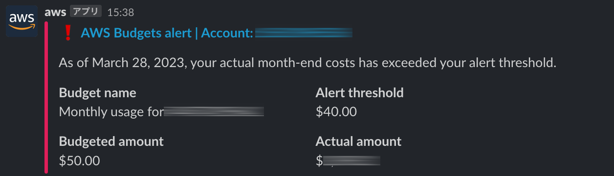

[](https://github.com/yicr/aws-budgets-notification/blob/main/LICENSE)
[](https://www.npmjs.com/package/@gammarer/aws-budgets-notification)
[](https://pypi.org/project/gammarer.aws-budgets-notification/)
<!-- [](https://www.nuget.org/packages/Gammarer.CDK.AWS.SecureFrontendWebAppCloudFrontDistribution/)  -->
[](https://s01.oss.sonatype.org/content/repositories/releases/com/gammarer/aws-budgets-notification/)
[](https://github.com/yicr/aws-budgets-notification/actions/workflows/release.yml)
[](https://github.com/yicr/aws-budgets-notification/releases)

# AWS Budgets Notification

A construct library for creating AWS Budgets Notification to Slack with the AWS CDK.


## Resources

This construct creating resource list.

- SNS Topic
- ChatBot SlackChannelConfiguration
- Budgets (linked account count or self)

## Install

### TypeScript

```shell
npm install @gammarer/aws-budgets-notification
# or
yarn add @gammarer/aws-budgets-notification
```

### Python

```shell
pip install gammarer.aws-budgets-notification
```

### Java

Add the following to pom.xml:

```xml
<dependency>
  <groupId>com.gammarer</groupId>
  <artifactId>aws-budgets-notification</artifactId>
</dependency>
```

## Example


```typescript
import { BudgetsNotification } from '@gammarer/aws-budgets-notification';

new BudgetsNotification(stack, 'BudgetsNotification', {
  slackWorkspaceId: 'T0XXXX111', // already AWS account linked your Slack.
  slackChannelId: 'XXXXXXXX', // already created your slack channel.
  budgetLimitAmount: 50,
  // optional linked account list
  linkedAccounts: [
    '111111111111',
    '222222222222',
  ],
});

```




## License

This project is licensed under the Apache-2.0 License.

# API Reference <a name="API Reference" id="api-reference"></a>

## Constructs <a name="Constructs" id="Constructs"></a>

### BudgetsNotification <a name="BudgetsNotification" id="@gammarer/aws-budgets-notification.BudgetsNotification"></a>

#### Initializers <a name="Initializers" id="@gammarer/aws-budgets-notification.BudgetsNotification.Initializer"></a>

```typescript
import { BudgetsNotification } from '@gammarer/aws-budgets-notification'

new BudgetsNotification(scope: Construct, id: string, props: BudgetsNotificationProps)
```

| **Name** | **Type** | **Description** |
| --- | --- | --- |
| <code><a href="#@gammarer/aws-budgets-notification.BudgetsNotification.Initializer.parameter.scope">scope</a></code> | <code>constructs.Construct</code> | *No description.* |
| <code><a href="#@gammarer/aws-budgets-notification.BudgetsNotification.Initializer.parameter.id">id</a></code> | <code>string</code> | *No description.* |
| <code><a href="#@gammarer/aws-budgets-notification.BudgetsNotification.Initializer.parameter.props">props</a></code> | <code><a href="#@gammarer/aws-budgets-notification.BudgetsNotificationProps">BudgetsNotificationProps</a></code> | *No description.* |

---

##### `scope`<sup>Required</sup> <a name="scope" id="@gammarer/aws-budgets-notification.BudgetsNotification.Initializer.parameter.scope"></a>

- *Type:* constructs.Construct

---

##### `id`<sup>Required</sup> <a name="id" id="@gammarer/aws-budgets-notification.BudgetsNotification.Initializer.parameter.id"></a>

- *Type:* string

---

##### `props`<sup>Required</sup> <a name="props" id="@gammarer/aws-budgets-notification.BudgetsNotification.Initializer.parameter.props"></a>

- *Type:* <a href="#@gammarer/aws-budgets-notification.BudgetsNotificationProps">BudgetsNotificationProps</a>

---

#### Methods <a name="Methods" id="Methods"></a>

| **Name** | **Description** |
| --- | --- |
| <code><a href="#@gammarer/aws-budgets-notification.BudgetsNotification.toString">toString</a></code> | Returns a string representation of this construct. |

---

##### `toString` <a name="toString" id="@gammarer/aws-budgets-notification.BudgetsNotification.toString"></a>

```typescript
public toString(): string
```

Returns a string representation of this construct.

#### Static Functions <a name="Static Functions" id="Static Functions"></a>

| **Name** | **Description** |
| --- | --- |
| <code><a href="#@gammarer/aws-budgets-notification.BudgetsNotification.isConstruct">isConstruct</a></code> | Checks if `x` is a construct. |

---

##### ~~`isConstruct`~~ <a name="isConstruct" id="@gammarer/aws-budgets-notification.BudgetsNotification.isConstruct"></a>

```typescript
import { BudgetsNotification } from '@gammarer/aws-budgets-notification'

BudgetsNotification.isConstruct(x: any)
```

Checks if `x` is a construct.

###### `x`<sup>Required</sup> <a name="x" id="@gammarer/aws-budgets-notification.BudgetsNotification.isConstruct.parameter.x"></a>

- *Type:* any

Any object.

---

#### Properties <a name="Properties" id="Properties"></a>

| **Name** | **Type** | **Description** |
| --- | --- | --- |
| <code><a href="#@gammarer/aws-budgets-notification.BudgetsNotification.property.node">node</a></code> | <code>constructs.Node</code> | The tree node. |

---

##### `node`<sup>Required</sup> <a name="node" id="@gammarer/aws-budgets-notification.BudgetsNotification.property.node"></a>

```typescript
public readonly node: Node;
```

- *Type:* constructs.Node

The tree node.

---


## Structs <a name="Structs" id="Structs"></a>

### BudgetsNotificationProps <a name="BudgetsNotificationProps" id="@gammarer/aws-budgets-notification.BudgetsNotificationProps"></a>

#### Initializer <a name="Initializer" id="@gammarer/aws-budgets-notification.BudgetsNotificationProps.Initializer"></a>

```typescript
import { BudgetsNotificationProps } from '@gammarer/aws-budgets-notification'

const budgetsNotificationProps: BudgetsNotificationProps = { ... }
```

#### Properties <a name="Properties" id="Properties"></a>

| **Name** | **Type** | **Description** |
| --- | --- | --- |
| <code><a href="#@gammarer/aws-budgets-notification.BudgetsNotificationProps.property.budgetLimitAmount">budgetLimitAmount</a></code> | <code>number</code> | *No description.* |
| <code><a href="#@gammarer/aws-budgets-notification.BudgetsNotificationProps.property.slackChannelId">slackChannelId</a></code> | <code>string</code> | *No description.* |
| <code><a href="#@gammarer/aws-budgets-notification.BudgetsNotificationProps.property.slackWorkspaceId">slackWorkspaceId</a></code> | <code>string</code> | *No description.* |
| <code><a href="#@gammarer/aws-budgets-notification.BudgetsNotificationProps.property.linkedAccounts">linkedAccounts</a></code> | <code>string[]</code> | *No description.* |

---

##### `budgetLimitAmount`<sup>Required</sup> <a name="budgetLimitAmount" id="@gammarer/aws-budgets-notification.BudgetsNotificationProps.property.budgetLimitAmount"></a>

```typescript
public readonly budgetLimitAmount: number;
```

- *Type:* number

---

##### `slackChannelId`<sup>Required</sup> <a name="slackChannelId" id="@gammarer/aws-budgets-notification.BudgetsNotificationProps.property.slackChannelId"></a>

```typescript
public readonly slackChannelId: string;
```

- *Type:* string

---

##### `slackWorkspaceId`<sup>Required</sup> <a name="slackWorkspaceId" id="@gammarer/aws-budgets-notification.BudgetsNotificationProps.property.slackWorkspaceId"></a>

```typescript
public readonly slackWorkspaceId: string;
```

- *Type:* string

---

##### `linkedAccounts`<sup>Optional</sup> <a name="linkedAccounts" id="@gammarer/aws-budgets-notification.BudgetsNotificationProps.property.linkedAccounts"></a>

```typescript
public readonly linkedAccounts: string[];
```

- *Type:* string[]

---


